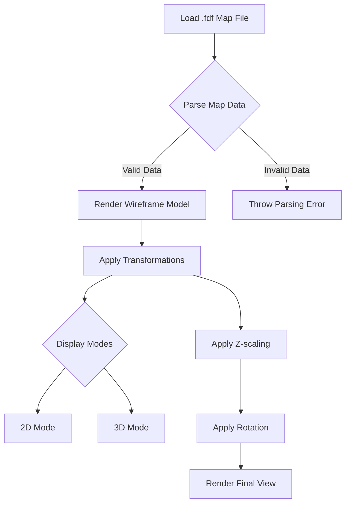

# FDF-Clone

A 42 Networks Graphics Project focused on building a 2D/3D Wireframe Model from scratch using the Minilibx library.

---

## 📦 How to Compile It

```bash
make && ./fdf maps/42.fdf
```


---

## ❓ What is FDF?

FDF is a 42 Networks cursus project that requires you to build a 3D/2D wireframe model from scratch using the Minilibx library. This project prepares you for future curriculum graphics projects such as Cub3d or Minirt.

Understanding this project thoroughly will help you grasp the mathematical principles required to render 3D shapes on a 2D plane (your computer screen).

---

## 🔄 Project Workflow



---

## 🎨 Features

- ### 🔄 Rotation
  

- ### 🌈 Multiple Random Colors
  

- ### 📏 Z-scaling
  

- ### 🖼️ 2D/3D Mode
  

- ### ⚡ High Flexibility
  

---

## 🚀 How to Run FDF

The program takes **1 argument** as input:

- The **map file** (must end with `.fdf` extension).
- The map should be **FDF compliant** (data should be organized in a readable format for the program to avoid parsing errors).

```bash
./fdf maps/your_map.fdf
```

---

## 📚 Resources

- [Scratchapixel](https://www.scratchapixel.com/)
- [Rasterization - Wikipedia](https://en.wikipedia.org/wiki/Rasterisation)
- [Bresenham's Line Drawing Algorithm](https://www.youtube.com/watch?v=RGB-wlatStc&t=445s)
- [DDA Line Drawing Algorithm](https://www.youtube.com/watch?v=W5P8GlaEOSI)
- [Graphics Masterclass with OpenGL](https://www.youtube.com/watch?v=c1li0SFhyMo&list=PLn3eTxaOtL2PuG1VfwmfAh46mT5N7lE4D)
- [Mathematics for Graphics](https://www.youtube.com/watch?v=6NB4Gn_BC_U&list=PLn3eTxaOtL2MfiIeGePe3tUGQ3Bi_IkXb)

---

## 💡 Contributing

Contributions are welcome! Please fork this repository and submit a pull request for any improvements or additional features.

---

## 📜 License

This project is licensed under the MIT License - see the [LICENSE](LICENSE) file for details.

---

## 🎥 Demo


---

*Happy coding and enjoy building your wireframe model!* 🚀✨
